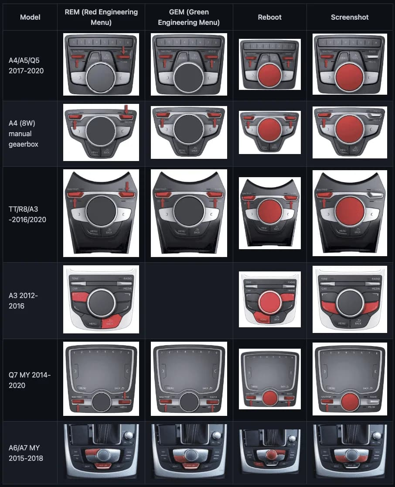

# Audi TT SD Card Installation Guide

Follow these steps to install the MIB Toolbox in an Audi with an MMI MIB2-based infotainment system.

## Red engineering menu

## Step 1: Check if SW Train is Supported
1. Enter the Red Engineering Menu:
   - Push the left scroll wheel switch and pull the right scroll wheel switch.
   - Hold for about 3 seconds until the Red Menu appears on the display.
2. Scroll down to **Version Information**.
   - Verify that the software train starts with "MHI2" (indicating MIB2 High system compatibility).

## Step 2: Insert SD Card and Start Installation
1. Start the car and allow the infotainment system to fully load (about 1 minute).
2. Insert the SD card into the **SD1 port** in the car’s glove box.
3. Re-enter the Red Engineering Menu using the same button combination as before.
4. In the Red Menu, select **Update**:
   - Choose **SD1** as the source.
   - Start the **MIB Launcher** installation and confirm the prompt.
   - Allow the system to install and reboot several times (do not interrupt).
  
## Step 3: Move the MIB update to the root of the SD card
1. Move everything except `maps-2024`, `virtual-dash`, and `mib` into a new folder.
2. Move the contents from the `mib` folder to the root of the SD card.
3. REPEAT STEP 2.

## Step 4: Verify Installation and Access the Green Engineering Menu
1. After the final reboot, let the system load for about a minute.
2. Enter the Green Engineering Menu:
   - Push both the left and right scroll wheel switches forward simultaneously for about 3 seconds.
3. In the Green Menu, locate and select **MIB**:
   - Review installed options and explore system information.
4. Perform the AIO patch
   - It's normally found under `patch_unit_aio` -> `PATCH NOW`
   - Carplay should be enabled / activated during this process for you

## Step 5: Exit the MIB Toolbox
1. To exit, press the **Menu** button.
2. Return to the normal infotainment screen.

## Step 6: Move the virtual dash update to the root of the SD card (This may not be required depending on the current version of your car's virtual dash)
1. Move everything except `maps-2024` and `virtual-dash` into a new folder.
2. Move the contents from the `virtual-dash` folder to the root of the SD card.
3. REPEAT STEP 2.

---

Maps
To update the maps:

Delete all files in the root of the SD card except for the maps-2024 directory.
Copy all contents from maps-2024 to the root of the SD card.
Use the car's map update functionality to complete the update.

Your installation is complete!
